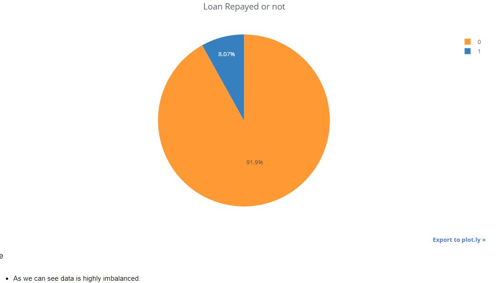
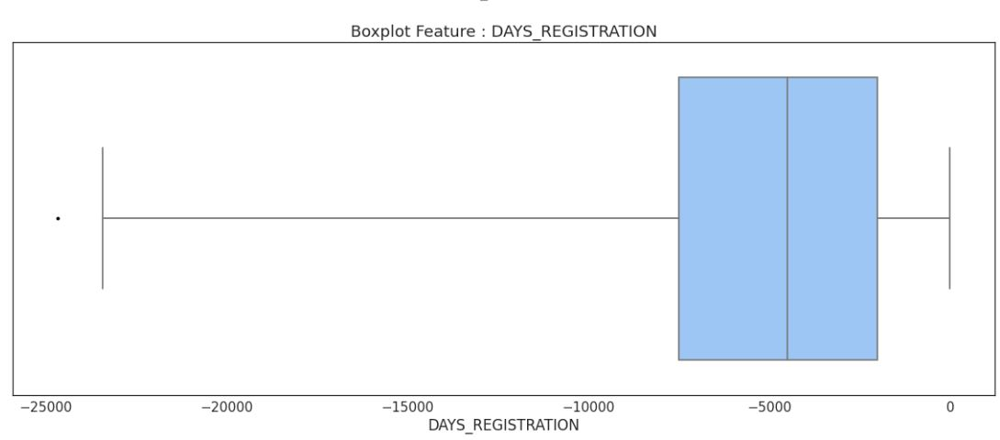
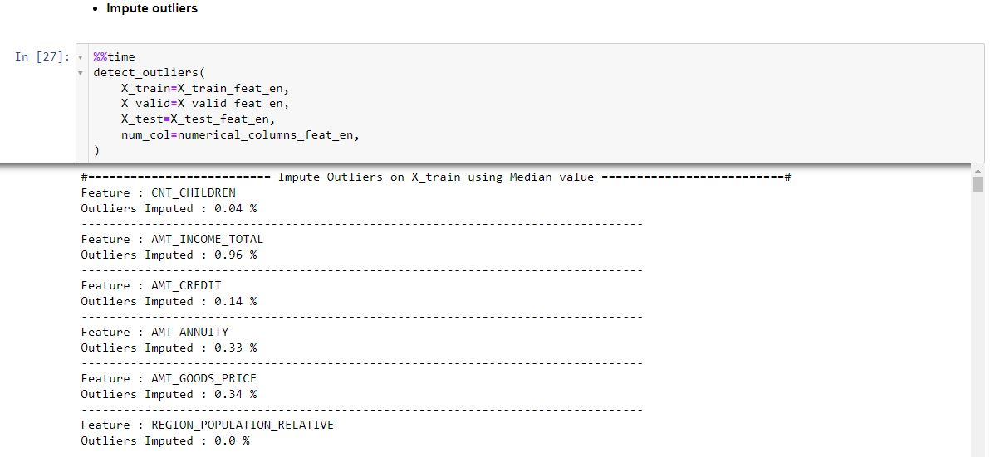
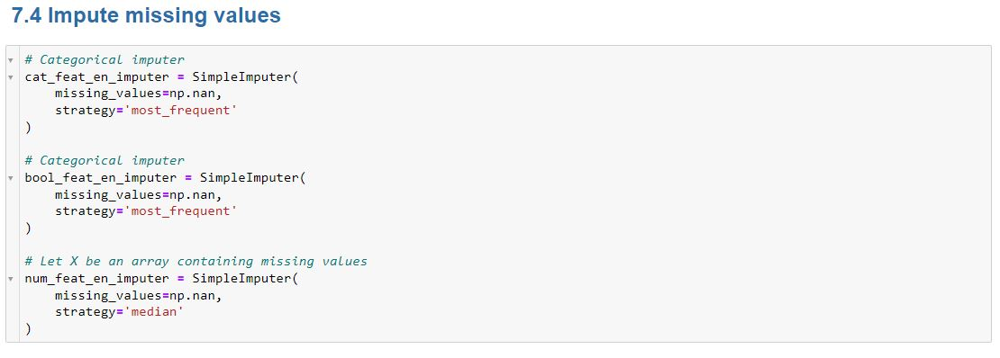

# Home_Credit_EDA
Notebook containing the Exploratory Data Analysis

## Exploratory Data Analysis

The EDA parts was done by LATHWAL, I used the first part of his [kaggle kernel](https://www.kaggle.com/codename007/home-credit-complete-eda-feature-importance)

## Preprocess Data

In this part of the notebook, we're going to handle **outliers**, **missing values** and also process data using **One Hot Encoding** for categorical data and **Robust Scaler** for numerical data.

### Handling outliers

- Example of **univariate outliers** detection

- Example of **imputing outliers** using **median value**

### Handling missing values
- Example of handling missing values : categorical  and boolean missing data was replaced by **mod value** and numerical missing data was replaced by **median value**

## EDA and API github links

There are two more GitHub repositories linked to the same project :

- APP : https://github.com/mohamedsidina/Home_Credit_FrontEnd
- API : https://github.com/mohamedsidina/Home_Credit_BackEnd
